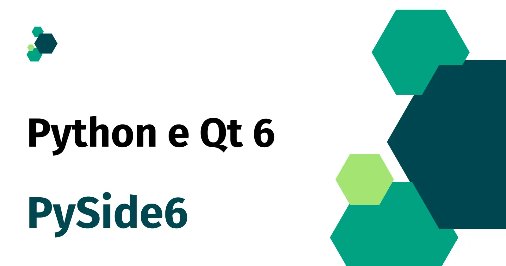

:og:type: site
:og:author: Renato Cruz (natorsc)
:og:title: Python (PySide6) e o framework gráfico Qt 6.
:og:description: Documentação criada centralizar dicas, tutoriais e exemplos de código sobre a construção de interfaces gráficas com a linguagem de programação Python (PySide6) e o framwork gráfico Qt 6.

.. meta::
   :author: Renato Cruz (natorsc)
   :description: Documentação criada centralizar dicas, tutoriais e exemplos de código sobre a construção de interfaces gráficas com a linguagem de programação Python (PySide6) e o framwork gráfico Qt 6.
   :keywords: Python, Python 3, PySide6, Qt, Qt 6,

   Criando interfaces gráficas com Python (PySide6) e o framework gráfico Qt 6.

============================================================================
Criando interfaces gráficas com Python (PySide6) e o framework gráfico Qt 6.
============================================================================

Documentação criada para centralizar dicas, tutoriais e exemplos de código sobre a construção de interfaces gráficas com a linguagem de programação Python (PySide6) e o framework gráfico Qt 6.

Sumário
=======

.. toctree::
   :caption: Sumário

   
   freedesktop
   widgets
   contribute
