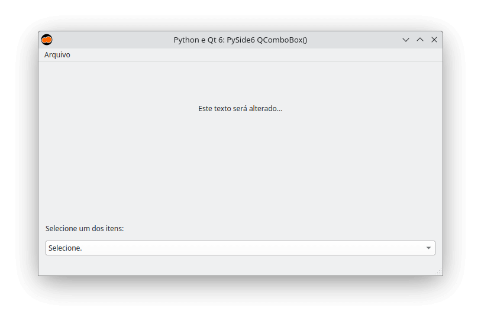

:og:author: Renato Cruz (natorsc)
:og:title: PySide6 widgets
:og:description: Exemplos de código dos widgets da biblioteca PySide6.

.. meta::
   :author: Renato Cruz (natorsc)
   :description: Exemplos de código dos widgets da biblioteca PySide6.
   :keywords: Python, Python 3, PySide6, Qt, Qt 6,

=======
Widgets
=======

Drag and drop
=============

  
  PySide6 Drag and drop

.. tab:: Python

   ..  literalinclude:: ../../src/drag-and-drop/MainWindow.py

--------------

QCalendarWidget
===============

  
  PySide6 QCalendarWidget

.. tab:: Python

   ..  literalinclude:: ../../src/qcalendarwidget/MainWindow.py

--------------

QCheckBox
=========

  
  PySide6 QCheckBox

.. tab:: Python

   ..  literalinclude:: ../../src/qcheckbox/MainWindow.py

--------------

QCombobox
=========

  
  PySide6 QCombobox

.. tab:: Python

   ..  literalinclude:: ../../src/qcombobox/MainWindow.py

--------------

QDateTimeEdit
=============

  
  PySide6 QDateTimeEdit

.. tab:: Python

   ..  literalinclude:: ../../src/qdatetimeedit/MainWindow.py

--------------

   QDial
=====

  
  PySide6 QDial

.. tab:: Python

   ..  literalinclude:: ../../src/qdial/MainWindow.py

--------------

QFileDialog file
================

.. tab:: Python

   ..  literalinclude:: ../../src/qfiledialog-file/MainWindow.py

--------------

QFileDialog folder
==================

.. tab:: Python

   ..  literalinclude:: ../../src/qfiledialog-folder/MainWindow.py

--------------

QFileDialog save
================

.. tab:: Python

   ..  literalinclude:: ../../src/qfiledialog-save/MainWindow.py

--------------

QFormLayout
===========

  
  PySide6 QFormLayout

.. tab:: Python

   ..  literalinclude:: ../../src/qformlayout/MainWindow.py

--------------

QHBoxLayout
===========

  
  PySide6 QHBoxLayout

.. tab:: Python

   ..  literalinclude:: ../../src/qhboxlayout/MainWindow.py

--------------

QLabel
======

  
  PySide6 QLabel

.. tab:: Python

   ..  literalinclude:: ../../src/qlabel/MainWindow.py

--------------

QLCDNumber
==========

  
  PySide6 QLCDNumber

.. tab:: Python

   ..  literalinclude:: ../../src/qlcdnumber/MainWindow.py

--------------

QListView
=========

  
  PySide6 QListView

.. tab:: Python

   ..  literalinclude:: ../../src/qlistview/MainWindow.py

--------------

QListWidget
===========

  
  PySide6 QListWidget

.. tab:: Python

   ..  literalinclude:: ../../src/qlistwidget/MainWindow.py

--------------

QLocale
=======

  
  PySide6 QLocale

.. tab:: Python

   ..  literalinclude:: ../../src/qlocale/MainWindow.py

--------------

QMainWindow
===========

  
  PySide6 QMainWindow

.. tab:: Python

   ..  literalinclude:: ../../src/qmainwindow/MainWindow.py

.. tab:: Python load ui

   ..  literalinclude:: ../../src/qmainwindow/uic/MainWindow.py

.. tab:: UI

   ..  literalinclude:: ../../src/qmainwindow/uic/MainWindow.ui
      :language: html

--------------

QMenuBar
========

  
  PySide6 QMenuBar

.. tab:: Python

   ..  literalinclude:: ../../src/qmenubar/MainWindow.py

--------------

QPrintDialog
============

  
  PySide6 QPrintDialog

.. tab:: Python

   ..  literalinclude:: ../../src/qmenubar/MainWindow.py

--------------

QProgressBar QThread
====================

  
  PySide6 QProgressBar QThread

.. tab:: Python

   ..  literalinclude:: ../../src/qprogressbar-qthread/MainWindow.py

--------------

QPushButton
===========

  
  PySide6 QPushButton

.. tab:: Python

   ..  literalinclude:: ../../src/qpushbutton/MainWindow.py

--------------

QRadioButton
============

  
  PySide6 QRadioButton

.. tab:: Python

   ..  literalinclude:: ../../src/qradiobutton/MainWindow.py

--------------

QScrollArea
===========

  
  PySide6 QScrollArea

.. tab:: Python

   ..  literalinclude:: ../../src/qscrollarea/MainWindow.py

--------------

QScrollBar
==========

  
  PySide6 QScrollBar

.. tab:: Python

   ..  literalinclude:: ../../src/qscrollbar/MainWindow.py

--------------

QSlider
=======

  
  PySide6 QSlider

.. tab:: Python

   ..  literalinclude:: ../../src/qslider/MainWindow.py

--------------

QStackedLayout
==============

.. tab:: Python

   ..  literalinclude:: ../../src/qstackedlayout/MainWindow.py

--------------

QStackedWidget
==============

  
  PySide6 QStackedWidget

.. tab:: Python

   ..  literalinclude:: ../../src/qstackedwidget/MainWindow.py

--------------

QStatusBar
==========

  
  PySide6 QStatusBar

.. tab:: Python

   ..  literalinclude:: ../../src/qstatusbar/MainWindow.py

--------------

QTableWidget
============

  
  PySide6 QTableWidget

.. tab:: Python

   ..  literalinclude:: ../../src/qtablewidget/MainWindow.py

--------------

QTabWidget
==========

.. figure:: ../images/widgets/qtabwidget.webp
  :alt: PySide6 QTabWidget
  :width: 683
  
  PySide6 QTabWidget

.. tab:: Python

   ..  literalinclude:: ../../src/qtabwidget/MainWindow.py

--------------

Qt Charts
=========

  
  PySide6 Qt Charts

.. tab:: Python

   ..  literalinclude:: ../../src/qtcharts/MainWindow.py

--------------

QTimer
======

  
  PySide6 QTimer

.. tab:: Python

   ..  literalinclude:: ../../src/qtimer/MainWindow.py

--------------

QToolBar
========

  
  PySide6 QToolBar

.. tab:: Python

   ..  literalinclude:: ../../src/qtoolbar/MainWindow.py

--------------

QTranslator
===========

.. tab:: Python

   ..  literalinclude:: ../../src/qtranslator/MainWindow.py

--------------

QVBoxLayout
===========

  
  PySide6 QVBoxLayout

.. tab:: Python

   ..  literalinclude:: ../../src/qvboxlayout/MainWindow.py

--------------

Signals and slots
=================

  
  PySide6 signals and slots

.. tab:: Python

   ..  literalinclude:: ../../src/signals-and-slots/MainWindow.py

--------------

Standard icon
=============

.. tab:: Python

   ..  literalinclude:: ../../src/standard-icon/MainWindow.py
